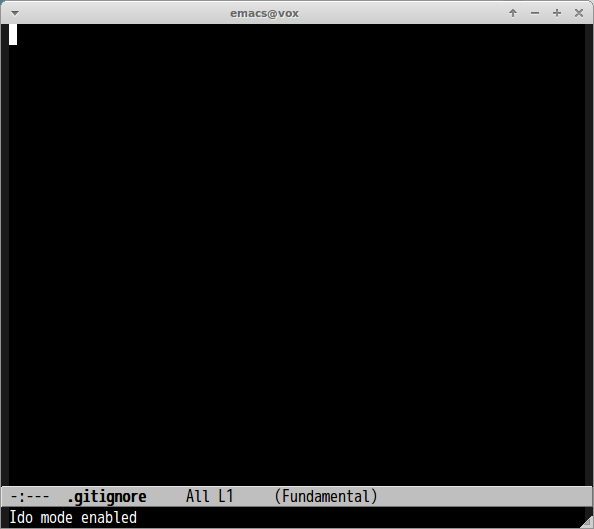

# gitignore.el

Generate .gitignore file from [gitignore.io](http://www.gitignore.io/)

## ScreenCast

## Command

#### `M-x gitignore`

Generating specified type .gitignore in current directory. If current file is .gitignore, then this command inserts response of gitignore.io response at current point.
